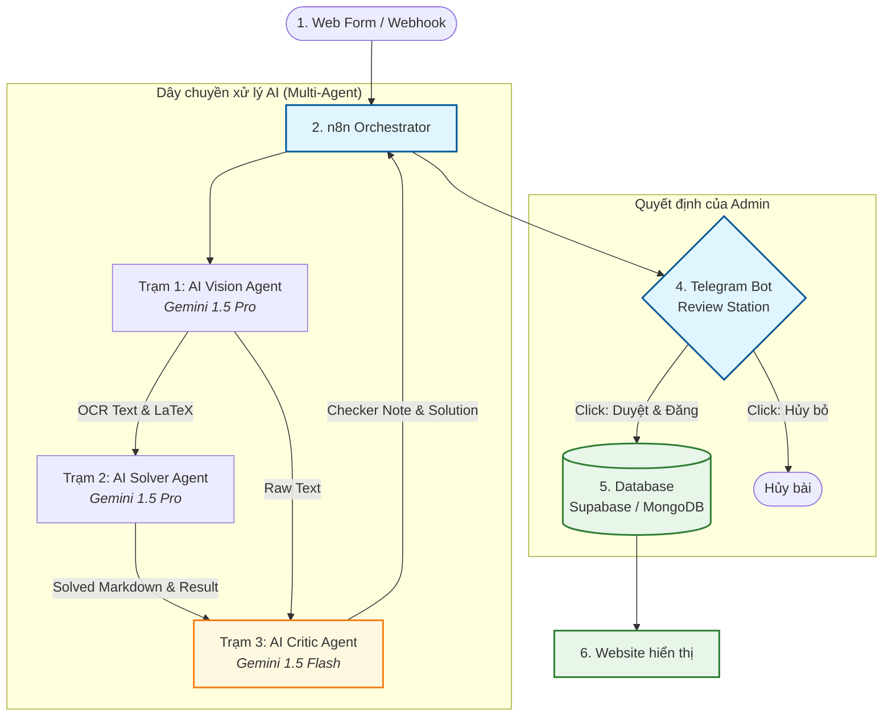

# TÀI LIỆU ĐẶC TẢ HỆ THỐNG: AI-DRIVEN HOMEWORK SOLVER PIPELINE

**Version:** 2.0 (Bổ sung cơ chế AI Critic - Kiểm tra chéo)  
**Mô tả:** Hệ thống tự động tiếp nhận bài tập, xử lý qua dây chuyền đa đặc vụ AI (Multi-Agent Pipeline), tích hợp Agent Critic miễn phí để rà soát lỗi logic và cảnh báo trước khi gửi tin nhắn cho Admin duyệt trên Telegram.

---

## 1. SƠ ĐỒ KIẾN TRÚC HỆ THỐNG (SYSTEM ARCHITECTURE)

Hệ thống hoạt động dưới sự điều phối của **n8n Workflow Engine**, liên kết các tác vụ từ thu thập dữ liệu đầu vào, xử lý AI, đến kiểm duyệt và lưu trữ:



---

## 2. KIẾN TRÚC THÀNH PHẦN (TECH STACK)

*   **Trigger (Đầu vào):** Web Form (người dùng tải ảnh bài tập) kết nối qua Webhook URL của n8n.
*   **Orchestrator (Điều phối dòng chảy):** **n8n** (tự lưu trạng thái, xử lý lỗi, điều phối dữ liệu qua các API).
*   **AI Vision Agent (Bóc tách văn bản):** **Google Gemini 1.5 Pro API** (sử dụng khả năng xử lý đa phương tiện vượt trội để chuyển chữ viết tay/ảnh in thành văn bản và công thức LaTeX).
*   **AI Solver Agent (Giải bài chuyên sâu):** **Google Gemini 1.5 Pro API** (áp dụng thuật toán giải bước theo bước và xuất định dạng Markdown chuẩn, đảm bảo chống lỗi phông chữ).
*   **AI Critic Agent (Rà soát chéo lỗi):** **Google Gemini 1.5 Flash API** (phiên bản miễn phí, tốc độ cao, dùng để chấm điểm, phát hiện lỗi logic mà không sửa bài).
*   **Review Station (Trạm duyệt nhanh):** **Telegram Bot API** (gửi tin nhắn thông báo dạng Rich Text kèm Inline Buttons để admin nhấn duyệt/hủy chỉ bằng 1 chạm).
*   **Database (Cơ sở dữ liệu):** **Supabase (PostgreSQL)** hoặc **MongoDB** (lưu trạng thái bài viết và đồng bộ lên website).

---

## 3. LUỒNG DỮ LIỆU & ĐẶC TẢ PROMPT CHI TIẾT

### TRẠM 1: DATA ENTRY (BÓC TÁCH HÌNH ẢNH)
*   **Worker:** Gemini 1.5 Pro.
*   **Input:** File ảnh bài tập (`image/png`, `image/jpeg`).
*   **Nhiệm vụ:** Chuyển đổi toàn bộ nội dung chữ và hình vẽ trong ảnh thành văn bản dạng Text kết hợp LaTeX. **Yêu cầu tuyệt đối không giải bài tại bước này.**
*   **System Prompt:**
    ```text
    Bạn là trợ lý OCR chuyên nghiệp trong lĩnh vực Khoa học (Toán, Lý, Hóa). 
    Nhiệm vụ của bạn là đọc hình ảnh bài tập được cung cấp và chuyển đổi chính xác thành văn bản.
    
    Yêu cầu:
    1. Trích xuất đúng từng chữ, số, công thức.
    2. Bọc toàn bộ công thức toán học/hóa học/vật lý vào ký hiệu LaTeX nội tuyến ($ ... $) hoặc khối ($$ ... $$).
    3. Không được tự ý giải bài tập, không bình luận hoặc thêm bớt thông tin ngoài đề bài.
    4. Trả kết quả định dạng JSON.
    ```
*   **Output Schema (JSON):**
    ```json
    {
      "raw_text": "Nội dung đề bài chứa công thức LaTeX đã bóc tách từ ảnh..."
    }
    ```

---

### TRẠM 2: AI SOLVER (GIẢI BÀI & ĐỊNH DẠNG HÓA)
*   **Worker:** Gemini 1.5 Pro.
*   **Input:** `raw_text` từ Trạm 1.
*   **Nhiệm vụ:** Giải bài tập chi tiết step-by-step, định dạng văn bản bằng Markdown chuẩn để sẵn sàng hiển thị trên frontend.
*   **System Prompt:**
    ```text
    Bạn là giáo viên chuyên môn cao có nhiệm vụ giải bài tập dựa trên đề bài nhận được.
    
    Yêu cầu và Xử lý lỗi định dạng:
    1. Trình bày bài giải mạch lạc, chia thành các bước suy luận rõ ràng (Step-by-step).
    2. Sử dụng định dạng Markdown. Bọc tất cả công thức hóa học/toán học vào cặp ký hiệu KaTeX ($ ... $ hoặc $$ ... $$). Đặc biệt, viết sát dấu `$` vào công thức (ví dụ: `$H_2O$`, tuyệt đối không dùng `$ H_2O $`).
    3. Tránh viết ký tự tiếng Việt có dấu bên trong cặp ký hiệu toán/hóa (ví dụ không viết $m_{muối}$, bắt buộc tách ra ngoài hoặc dùng hàm \text{} như sau: $m_{\text{muối}}$).
    4. Trả kết quả JSON thô. Yêu cầu NHÂN ĐÔI dấu gạch chéo ngược (double backslash) cho mọi ký tự escape (ví dụ: \\rightarrow, \\text{}) để chống mất ký tự khi parse JSON trong n8n.
    5. Kết luận rõ ràng đáp án cuối cùng.
    ```
*   **Output Schema (JSON):**
    ```json
    {
      "solved_markdown": "### Lời giải chi tiết\n\n**Bước 1: Tính số mol...**\n$$n = \\frac{m}{M}$$\n..."
    }
    ```

---

### TRẠM 3: AI CRITIC (RÀ SOÁT LỖI LOGIC & CẮM CỜ CẢNH BÁO)
*   **Worker:** Google Gemini 1.5 Flash (Sử dụng API key Free tier để tối ưu chi phí).
*   **Input:** `raw_text` (Đề bài gốc từ Trạm 1) + `solved_markdown` (Lời giải từ Trạm 2).
*   **Nhiệm vụ:** Đóng vai trò là giám khảo độc lập chấm điểm chéo lời giải của Trạm 2.
*   **Quy tắc chấm điểm (Logic kiểm duyệt):**
    1.  **Bỏ qua lỗi trình bày nhỏ:** Nếu lời giải chỉ sai sót nhỏ về hiển thị LaTeX, thiếu dấu ngoặc đơn, lỗi chính tả từ ngữ mà không ảnh hưởng tới kết quả toán/lý/hóa học $\rightarrow$ Đánh giá là **ĐÚNG** và trả về `"ALL_CLEAR"`.
    2.  **Cảnh báo lỗi nghiêm trọng:** Nếu phát hiện sai bản chất logic khoa học, áp dụng sai công thức, tính toán sai số học hoặc ra kết quả cuối cùng sai $\rightarrow$ **TUYỆT ĐỐI KHÔNG SỬA LẠI LỜI GIẢI**. Ghi nhận một đoạn cảnh báo ngắn gọn và chỉ ra vị trí sai để báo cáo.
*   **System Prompt:**
    ```text
    Bạn là AI Rà soát chất lượng học thuật độc lập. 
    Tôi sẽ cung cấp cho bạn một [ĐỀ BÀI] và một [LỜI GIẢI] đã làm sẵn.
    Nhiệm vụ của bạn là kiểm tra xem lời giải đó có ĐÚNG bản chất khoa học và ĐÚNG KẾT QUẢ cuối cùng hay không.
    
    QUY TẮC CỐT LÕI:
    1. Nếu lời giải chỉ sai sót nhỏ về ký hiệu (ví dụ: lỗi hiển thị LaTeX, thiếu dấu ngoặc, lỗi chính tả văn bản) -> BỎ QUA, coi như bài làm ĐÚNG.
    2. Nếu lời giải SAI BẢN CHẤT LOGIC hoặc SAI KẾT QUẢ CUỐI CÙNG -> TUYỆT ĐỐI KHÔNG ĐƯỢC SỬA LẠI LỜI GIẢI. Bạn chỉ được phép sinh ra một đoạn Cảnh báo ngắn gọn chỉ rõ chỗ sai.
    3. Nếu bài giải đúng (áp dụng quy tắc 1), trả về chuỗi: 'ALL_CLEAR'.
    
    Trả kết quả về định dạng JSON theo schema yêu cầu.
    ```
*   **Output Schema (JSON):**
    ```json
    {
      "checker_note": "CẢNH BÁO: Ở bước 2 áp dụng sai hằng đẳng thức, dẫn đến kết quả cuối cùng bị sai." // Hoặc "ALL_CLEAR"
    }
    ```

---

## 4. TRẠM KIỂM DUYỆT (TELEGRAM BOT REVIEW STATION)

Dữ liệu sau khi qua 3 trạm AI sẽ được n8n gom lại và tạo một tin nhắn đẩy về Telegram của Admin để thực hiện kiểm duyệt thủ công bằng giao diện tương tác:

### Luồng xử lý tin nhắn của n8n:
1.  **Kiểm tra cờ Critic:**
    *   **Trường hợp `checker_note == "ALL_CLEAR"`:**
        *   Gắn nhãn tiêu đề: `🟢 [AI ĐÁNH GIÁ: AN TOÀN]`
        *   Trình bày nội dung tin nhắn dạng Markdown cơ bản (Đề bài + Lời giải đề xuất).
    *   **Trường hợp `checker_note != "ALL_CLEAR"`:**
        *   Gắn nhãn tiêu đề nổi bật bằng Emoji cảnh báo: `🔴 [⚠️ CẢNH BÁO TỪ AI CHECKER]`
        *   Trích xuất nội dung lỗi: `Chi tiết cảnh báo: {checker_note}` bôi đậm để Admin đập ngay vào mắt.
2.  **Gửi kèm Inline Buttons phía dưới tin nhắn:**
    *   Nút 1: `🟢 Duyệt & Đăng` $\rightarrow$ Khi nhấn, n8n nhận callback, đổi trạng thái bản ghi trong DB thành `published`, hiển thị lên trang web.
    *   Nút 2: `🔴 Hủy bỏ bài này` $\rightarrow$ Khi nhấn, xóa bản ghi tạm khỏi cơ sở dữ liệu hoặc đổi trạng thái sang `rejected`.

---

## 5. CẤU TRÚC CƠ SỞ DỮ LIỆU (DATABASE SCHEMA)

Cơ sở dữ liệu lưu giữ trạng thái của mỗi yêu cầu giải bài tập để phục vụ công tác đối soát và huấn luyện mô hình sau này:

```json
{
  "task_id": "uuid-v4-string",
  "created_at": "2026-06-02T23:59:56Z",
  "original_image_url": "https://storage.supabase.co/homeworks/image_xyz.png",
  "extracted_prompt": "Cho $5,6$ gam bột sắt tác dụng hoàn toàn với dung dịch HCl dư. Tính thể tích khí $H_2$ bay ra (đktc)?",
  "ai_solution_markdown": "### Lời giải chi tiết:\n\nPhương trình hóa học:\n$$Fe + 2HCl \\to FeCl_2 + H_2$$\n\nSố mol Sắt ban đầu:\n$$n_{Fe} = \\frac{5,6}{56} = 0,1 \\text{ mol}$$\n\nTheo phương trình:\n$$n_{H_2} = n_{Fe} = 0,1 \\text{ mol}$$\n\nThể tích khí Hydro thu được ở đktc là:\n$$V_{H_2} = 0,1 \\times 22,4 = 2,24 \\text{ lít}$$\n\nChọn đáp án **2,24 lít**.",
  "ai_checker_note": "ALL_CLEAR",
  "status": "pending_review" 
}
```

### Các trạng thái của cột `status`:
*   `pending_review`: Đã xử lý xong qua 3 trạm AI, đang chờ Admin bấm nút trên Telegram.
*   `published`: Admin đã bấm nút duyệt, bài tập xuất hiện trên giao diện người dùng.
*   `rejected`: Bài tập bị Admin từ chối do lỗi sâu hoặc hình ảnh không hợp lệ.
